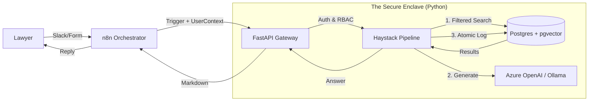

# Evaluation: Project Lexicon (Secure Legal RAG)

## 1. Executive Assessment
The PRD outlines a solid, "Privacy-First" architecture. The decision to decouple Orchestration (n8n) from Inference (Python/Haystack) is excellent—it provides the flexibility of low-code triggers with the power of code-based RAG.

However, to truly meet the "Legal-Grade" requirement (Security, Auditability, Reliability), I recommend tightening the architecture in three specific areas.

## 2. Strategic Refinements

### A. Security & RBAC Location (Critical)
- **Current Plan:** "n8n ensures that only authorized Case Leads can query..."
- **Critique:** Enforcing security only at the orchestration layer (n8n) is risky. If the internal API is exposed or changed, security could be bypassed.
- **Recommendation:** Move **RBAC enforcement down to the FastAPI/Database layer**.
    - The API should accept a `user_context` (ID/Role).
    - The `Retriever` in Haystack should automatically apply filters (e.g., `filter={'collection_id': {'$in': user.allowed_collections}}`) to ensure a user literally *cannot* retrieve chunks they aren't authorized to see.

### B. The Vector Database Choice
- **Current Plan:** Qdrant or Milvus.
- **Alternative:** **PostgreSQL with `pgvector`**.
- **Reasoning:** You already require PostgreSQL for the **Audit Trail**.
    - **Pros of Postgres:** leveraging a single database for both *Vectors* and *Audit Logs* allows for **ACID transactions**. You can guarantee that "If a query is run, it is logged." If the log fails, the query fails. This is a massive compliance win.
    - **Cons:** Slightly lower raw performance at massive scale (>10M vectors).
- **Recommendation:** Unless you anticipate millions of case files immediately, **PostgreSQL** is the superior "Legal-Grade" choice for data consistency.

### C. Logic Ownership (n8n vs. Python)
- **Current Plan:** n8n handles "Error Handling", "Retry Logic", and "Formatting".
- **Critique:** Spreading business logic into n8n makes it hard to unit test and version control.
- **Recommendation:** Treat n8n as a **"Dumb Pipe"**.
    - **Ingestion:** n8n watches a folder -> Sends file to FastAPI. FastAPI handles cleaning/chunking/errors.
    - **Query:** n8n receives Slack msg -> Sends text to FastAPI. FastAPI handles retries/logging/formatting -> Returns answer.
    - **Benefit:** Your entire "Brain" is in Python, where it can be tested with `pytest` and audited.

## 3. Proposed "Legal-Grade" Architecture

## 4. Key Questions to Proceed

To finalize the technical specification, I need to clarify your preference on the **Database Strategy**:

**Do you prefer to stick with a specialized Vector DB (Qdrant) for performance, or consolidate on PostgreSQL for stricter data consistency/compliance?**
